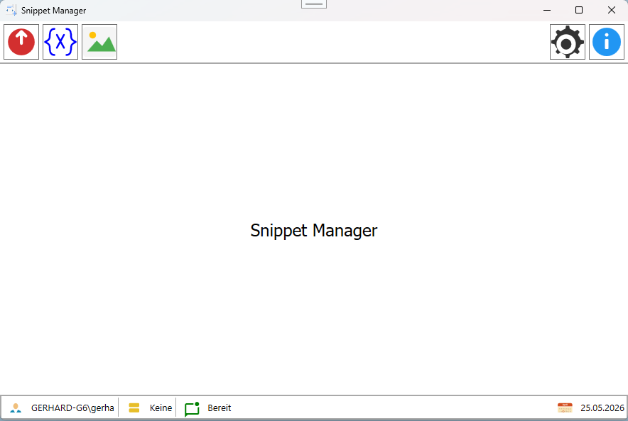
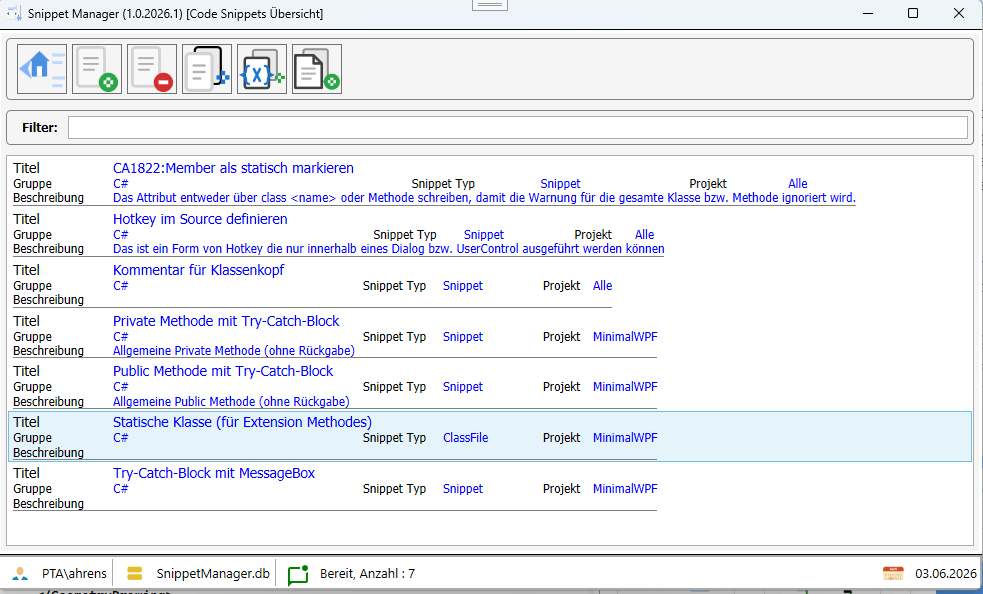
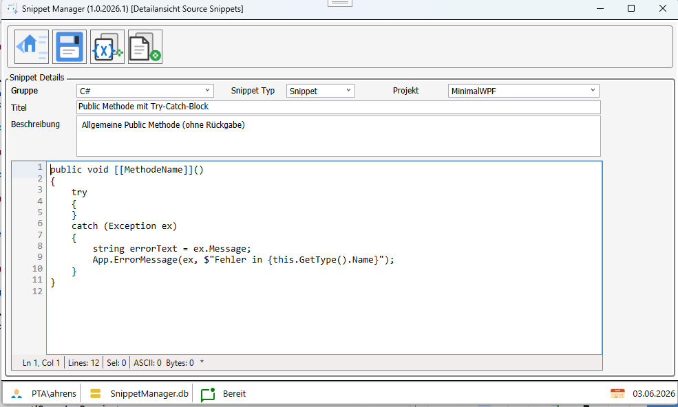
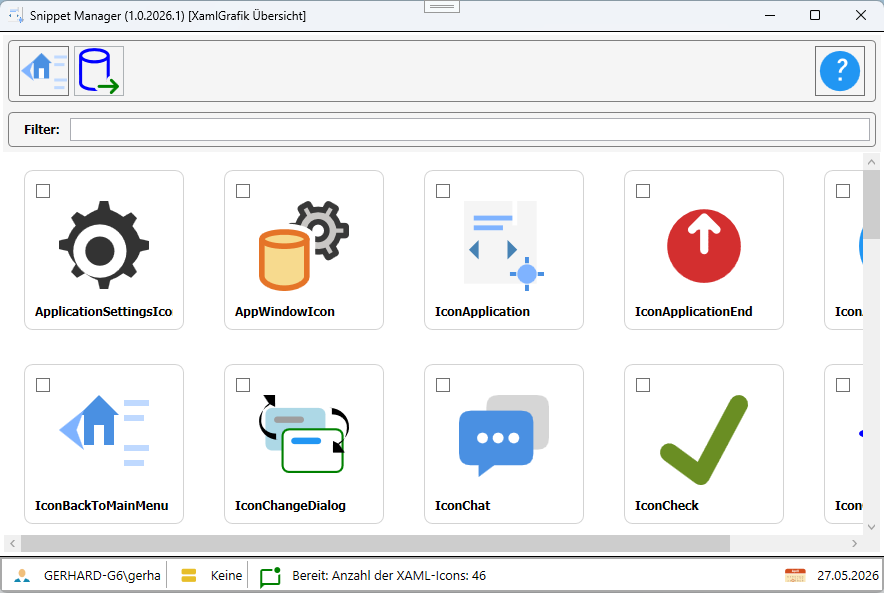

# Snippet Manager


# Projekt

Der Snippet Manager ist eine Anwendung, die es Benutzern ermöglicht, Code-Snippets zu erstellen, zu organisieren und zu verwalten. Es bietet eine benutzerfreundliche Oberfläche, um Snippets schnell zu speichern und wiederzuverwenden.
Die Anwendung ist aus heutiger Sicht eher etwas Old-School, da in vielen Bereichen mitlerweile KI gestützt entwicklet wird. Daher ging es mir weniger um die sinnhaftigkeit sonder eher um verschiedene Patterns und Möglichkeiten in der Anwendung zu implentieren und auszuprobieren.

In der Hauptsache ging es mir um den EventAggregator, Factory-Pattern, sowie Windows und UserControl von einer Basisklasse abzuleiten. In der Anwendung wird das Prinzip verwendet, das UserControls über eine Factory als Dialoge geladen werden. Die Steuerung zwischen den Dialogen erfolgt über den EventAggregator.
Somit habe ich eine vollständige lose Koppelung zwischen den Dialogen erreicht. Es gibt keine direkte Referenz von einem Dialog zu anderen Dialogen, sondern die Kommunikation erfolgt ausschließlich über den EventAggregator.

## Hauptdialog



## Snippet Dialog
Der Snippet Dialog ermöglicht es Benutzern, neue Snippets zu erstellen oder bestehende zu bearbeiten. Hier können Titel, Beschreibung, Code und Tags hinzugefügt werden.
Ein gewähltes Snippet kann kann je nach Typ in die Zwischenablage kopiert werden oder auch über die Zwischenablage als Datei an biliebiger Stelle eingefügt werden.
Das ist besonders sinnvoll, wenn das Snippet z.B. eine Klasse oder Enum ist.

### Übersicht Snippet Dialog



### Dialog zur Bearbeitung eienes Snippets



## XAML Icon Dialog
Übersicht von XAML Icons auf Basis vom Typ ``DrawingImage``. Diese können in der gesamten Anwendung verwendet werden, um konsistente und ansprechende Symbole darzustellen.\
in dem Dialog kann nach Namen gefiltert werden. Bei einem Doppelklick auf das Symbol wird der XAML Source in die Zwischenablage kopiert.



Ergebnis nach dem Einfügen aus der Zwischenablage.
```XML
<DrawingImage x:Key="IconChat">
  <DrawingImage.Drawing>
    <DrawingGroup>
      <DrawingGroup.Children>
        <GeometryDrawing Brush="#FFD6D6D6">
          <GeometryDrawing.Geometry>
            <PathGeometry Figures="M11,3L21,3Q24,3,24,6L24,14Q24,17,21,17L17,17L13,21L13,17L11,17Q8,17,8,14L8,6Q8,3,11,3z" />
          </GeometryDrawing.Geometry>
        </GeometryDrawing>
        <GeometryDrawing Brush="#FF4A90E2">
          <GeometryDrawing.Geometry>
            <PathGeometry Figures="M4,7L17,7Q20,7,20,10L20,18Q20,21,17,21L10,21L6,24L6,21L4,21Q1,21,1,18L1,10Q1,7,4,7z" />
          </GeometryDrawing.Geometry>
        </GeometryDrawing>
        <GeometryDrawing Brush="#FFFFFFFF">
          <GeometryDrawing.Geometry>
            <EllipseGeometry RadiusX="1.4" RadiusY="1.4" Center="7,14" />
          </GeometryDrawing.Geometry>
        </GeometryDrawing>
        <GeometryDrawing Brush="#FFFFFFFF">
          <GeometryDrawing.Geometry>
            <EllipseGeometry RadiusX="1.4" RadiusY="1.4" Center="11,14" />
          </GeometryDrawing.Geometry>
        </GeometryDrawing>
        <GeometryDrawing Brush="#FFFFFFFF">
          <GeometryDrawing.Geometry>
            <EllipseGeometry RadiusX="1.4" RadiusY="1.4" Center="15,14" />
          </GeometryDrawing.Geometry>
        </GeometryDrawing>
      </DrawingGroup.Children>
    </DrawingGroup>
  </DrawingImage.Drawing>
</DrawingImage>
```

# Features
- Import von Xaml Icons Dateien vom Typ ``DrawingImage`` und ``Viewbox``.
- Ein Icon aus der Datenbank kann per Doppelklick als XAML Code vom Typ ``DrawingImage`` in die Zwischenablage kopiert werden.
- Ein Auswahl von Icons kann als XAML Code vom Typ ``DrawingImage`` können in ein Resource Dictionary gesammelt und in die Zwischenablage kopiert werden.

# Versionshistorie

- Erstes Release
- README.md aktualisiert und Screenshots hinzugefügt.


- Erste Version
